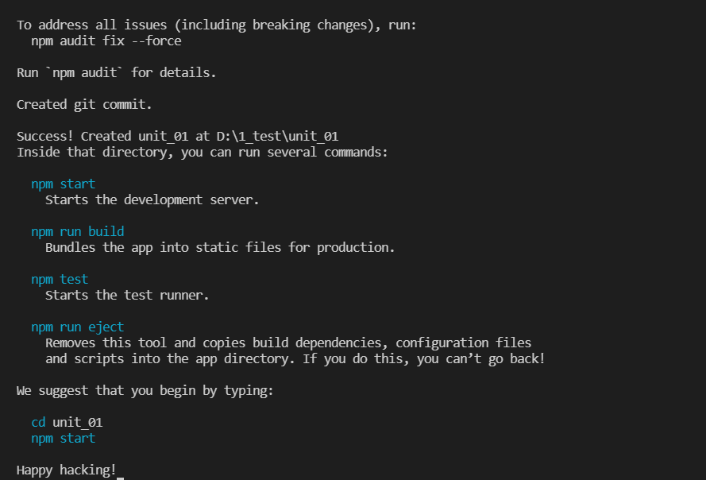

#UNIT 01
#Что такое React?
#Зачем он нужен?
#Установка и базовая структура
#Запуск приложения React

*В документации используется названия React, React.js, ReactJS. Рекомендуется использовать название React.*

## 1.Что такое React?

React это библиотека JavaScript для разработки интерфейса приложений. Очень часто можно встретить утверждение, что React это фреймворк. Не будем спорить по данному вопросу, поскольку на официальном сайте указано, что React - библиотека.

Главное, что нужно понять - React это JavaScript. Все ограничения и возможности React, полностью совпадает с возможностями JavaScript. React это не замена backend языкам node.js, PHP, Python, Java. React не может то, что могут backend языки программирования. Хотя, учитывая то, что React собирают и запускают на базе node.js, то возможны некоторые "фокусы", которые путают начинающих пользователей. Запоминаем - React не может ничего того что не может JavaScript.

React это инструмент для создания интерфейсов. Зачем это нужно? Смотрите, пока вы работаете в команде где один frontend программист и один backend программист все отлично. Каждый программист пишет в привычном стиле. Когда у вас в команде 10 человек frontend  - то нужен code guide. Если у вас 500 программистов и программный продукт живет и существует много лет, то даже code guide не поможет. Нужны строгие правила написания кода уже на уровне программирования. React ( фреймворк, библиотека) и реализует подобные правила, что позволяет множеству программистов писать код более менее одинаково.

Применение React в проекте, позволяет разрабатывать программный продукт одновременно множеству программистов и надеяться на то, что разные части кода будут взаимодействовать между собой.
   Как и любая библиотека, фреймворк, написание кода на React будет более объемно чем написание на нативном JavaScript.

## 2.Зачем нужен React?
Первой технологией, которая позволяла создавать веб сайты был статический HTML. Программист делал страницы HTML и помещал их на сервер. При запросе сайта в браузере, сервер просто отдавал готовые страницы, а браузер их отображал.

Появление PHP позволило чуть модифицировать работу сайта, сделав его более интерактивным. Теперь работа сервера была чуть другая. Вы запросили сервер дать информацию. На сервере запускаются PHP который создает HTML код и отдает браузеру. Отличие от предыдущего способа в том, что код HTML формируется динамически.

Предыдущий подход хорош для не очень больших проектов. Потому что на сервер взваливается вся работа по созданию HTML кода. React реализует следующую ступень - разделение frontend и backend части. Т.е. есть код отвечающий строго за frontend часть и есть код отвечающий за backend часть. Коды могут работать как на одном сервере, так и на разных. Когда пользователь запрашивает сайт - то загружается frontend часть ( React). При необходимости данных с backend сервера, frontend запрашивает данные с backend сервера и показывает их пользователю. Подобное разделение удобно в плане гибкости разработки и распределения нагрузок. Общение frontend - backend также строго стандартизировано. Важно! Такое взаимодействие легко реализуется и на нативном JavaScript и не является прерогативой React.

Таким образом, React позволяет разрабатывать интерфейс сайта ( приложения) и общение между интерфейсом и backend.

Поскольку мы постоянно говорим React и интерфейс, правильнее говорить UI, то логично, что React содержит средства для удобной разработки именно интерфейса. Мы увидим это позже. 

## 3.Установка React

React это библиотека, следовательно можно подключить React как обычный скрипт, через script src. Однако такой способ не является современным. Рекомендуется разворачивание React на основе node.js. 

Установите node.js скачав приложение с [официального сайта](https://nodejs.org) . На момент написания книги LTS версия node.js 16.14, а самая новая - 17.8.
   Если установка node.js вызывает проблемы - задайте вопрос на сайте [itgid.info](http://itgid.info). 

После установки node.js запустите консоль и наберите код:

```
npx create-react-app unit_01
```

Если вы первый раз применяете команду `create-react-app` то консоль предложит вам установить пакет:
```
Need to install the following packages:
create-react-app
Ok to proceed? (y)
```

Нажмите `y`.

Давайте изучим эту команду:

- `create-react-app` создает экземпляр приложения React в текущей папке
- **unit_01** это название папки, в которой будет создано приложение

Если все сделано верно, то вы получите вывод в консоль: 



1.1 Приложение React установлено

В ходе установки могут выводиться **WARN** предупреждения по различным пакетам. Увы это следствие пакетных менеджеров.

После установки будет создана папка с именем **unit_01**. Для запуска приложения нужно войти в нее с помощью команды:
```
cd unit_01
```

Структуру приложения мы рассмотрим дальше.

## 4.Структура приложения React

Изучим как выглядит структура приложения React.

- **BUILD**. Здесь будет размещен код проекта перед сборкой и выкладыванием на сервер, после выполнения команды npm run build. 

- **NODE_MODULES**. Пакеты React. Данная папка является служебной. Если передаете код приложения, удаляйте эту папку. Восстановить ее содержимое можно запустив команду
   npm i 

- **PUBLIC**. Содержит скелет приложения: файлы index.html, CSS файлы, изображения и другую статику. Если изучить index.html то увидите как подключается код React. Index.html выступает как точка входа в приложение React. 

- **SRC**. размещается созданное React приложение 

- **.gitignore**. Файл для работы с VCS системами. Например, GitHub. 

- **package-lock.json**. Файл с информацией о установленных пакетах и версиях пакетов. 

- **package.json**. Файл с информацией о необходимых пакетах, версиях, командах запуска. 

- **README.md** 

Содержимое папки SRC выглядит следующим образом.

- **App.css**. Содержит оформление компонента App.js. Обратите внимание, что все стили внутри написаны с префиксом App- это сделано потому, что стили прописанные в таких файлах не являются изолированными и действуют на весь проект. 

- **App.js**. Компонент приложения. Мы дальше поговорим о компонентах. 

- **App.test.js**. Файл для тестирования компонента. На начальных этапах учебы может быть удален. 

- **index.css**

- **index.js** – точка входа в приложение. Здесь подключен компонент App.js. Данный файл подключается в index.html. 

- **logo.svg**

- **reportWebVitals.js**. Компонент для отслеживания различных показателей приложения ( например времени отклика). На начальных этапах обучения можно удалить. При удалении не забывайте отключить его в index.js.
   setupTests.js. Файл для подключения jest – фреймворка для тестирования. 

- **.gitignore**

Таким образом у нас есть index.html где находится элемент:

```
<div id="root"></div>
```

Файл index.js подключает в него компонент App React:

```
ReactDOM.render(
  <React.StrictMode>
   <App />
  </React.StrictMode>,
document.getElementById('root')
);
```

## 5.Запуск приложения React

Для запуска приложения React выполните команду:
```
npm start
```
в папке приложения. 

После запуска откроется окно браузера с адресом localhost:3000. Если порт 3000 занят, то можно выбрать другой порт.

## Итог
В этом юните мы выполнили установку и изучили структуру приложения React. Запустили приложение.