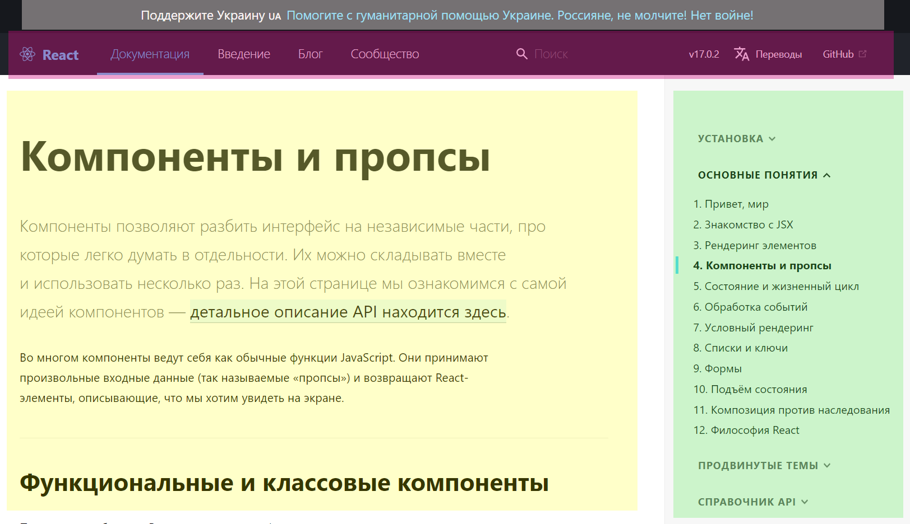
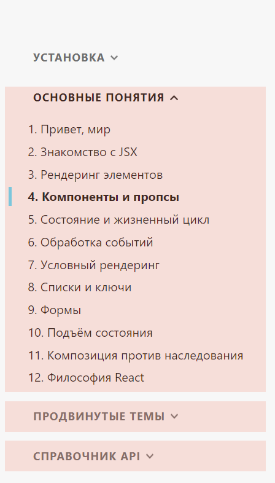

# Компоненты React

# Что такое компонент? Назначение компонента
# Структура компонента
# Подключение компонентов
# Оформление компонентов

## 1. Что такое компонент? Назначение компонента

Компонент — это основной элемент построения интерфейса приложения в React, строительный кирпич, блоки из которых строится приложение.

Компонентный подход позволяет разбить приложение на изолированные (это очень важно!) элементы и разрабатывать их независимо друг от друга, определив только правила взаимодействия компонентов. Плюсом компонентного подхода является возможность использовать компоненты повторно, т.е. применять один и тот же компонент в разных частях сайта. 

Не существует строгих правил, что помещать в компонент. Выбор содержимого компонента проводится исходя из опыта и предпочтения разработчика. Обычно это планируется на этапе разработки документации, либо уже (что хуже) в ходе разработки. Всегда есть возможность разбить сложный компонент на несколько, более мелких. 

Давайте рассмотрим пример простого сайта — официального сайта React.



_Рис. 2.1. Пример компонентов_

На сайте можно выделить минимум 4 компонента:

1. баннер (полупрозрачный белый блок над заголовком) — **Banner.js**
2. заголовок сайта (красный полупрозрачный блок) — **Header.js**
3. боковая панель (зеленый полупрозрачный блок) — **Aside.js**
4. основной материал (желтый полупрозрачный блок) — **Main.js** 

В реальности, компонентов будет больше, мы забыли указать **Footer.js** etc. Обратите внимание, я привел примерные имена компонентов, вы можете называть их как угодно, и все имена начинаются с большой буквы. Название с UpperCase не является стандартом, однако считается хорошим тоном. 

Разбив сайт на компоненты таким образом, вы можете начать параллельно разрабатывать одновременно каждую часть сайта в каждой команде, что значительно повышает производительность.

Обратите внимание, в боковой панели у вас есть минимум 3 раскрывающихся списка. Можно создать один компонент, который будет принимать массив данных и выводить раскрывающийся список и 3 раза вызвать данный компонент в компоненте **Aside.js** передав ему три разных массива данных. Таким образом, компонентный подход позволяет экономить ресурсы и сделать код более понятным.



_Рис. 2.2 Для вывода раскрывающихся списков можно 3 раза применить один компонента_

## 6. Структура компонента

Когда мы создавали новое приложение с помощью команды `create-react-app`, то React создавал компонент **App.js**, давайте рассмотрим его структуру. 

Существует два подхода к созданию и написанию компонентов. Первый — с применением ООП подхода, иногда называют классовым подходом, второй с применением синтаксиса функций, называют функциональный подход. В последних версиях React именно функциональный подход является основным.

Рассмотрим код **App.js**.

```javascript
import logo from './logo.svg';
import './App.css';

function App() {
 return (
  <div className="App">
   <header className="App-header">
    
    <p>Edit <code>src/App.js</code> and save to reload.</p>
   <a className="App-link" href="https://reactjs.org">Learn React</a>
  </header>
 </div>
);
}

export default App;
```
_Рис. 2.3 Листинг компонента App.js_

В начале файла идет импорт необходимых элементов — в данном случае svg файла и CSS файла оформления. Аналогично можно подключать другие компоненты.

Дальше идет сам компонент — функция App. В данном случае функция написана как именованная:

```javascript
function App () {
    
}
export default App;
```

Обратите внимание на строку `export` – это позволяет нам экспортировать компонент и подключать в других частях приложения. Так, данный компонент подключен в index.js.

Рассмотрим второй вариант написания компонента **App2.js**  — с помощью анонимной функции (вы можете скачать код урока):

```javascript
export default () => {
    return (
        <div>Hello</div>
    );
}
```
В данном случае имя функции не указано, применена стрелочная анонимная функция. Имя компонента — будет задаваться при импорте компонента.

Вернемся к компоненту **App.js**. Внутри компонента находится `return` со странной смесью JavaScript и HTML. Данная смесь написана с применением синтаксиса `JSX` (мы рассмотрим его в следующей главе). А блок внутри `return` – это то, что будет выведено на странице при отображении компонента (иногда называют render).

**Важно!** Внутри `return ()` должен находиться только один вложенный блок. Т.е. все остальные блоки должны быть вложены в него. В компоненте **App.js** таким блоком выступает div:

```javascript
return (
    <div className="App"></div>
);
```

**Важно!** Обратите внимание на атрибут `className` для стилей CSS. Поскольку мы пишем return применяя JSX (который является смесью JavaScript + HTML), а в JavaScript слово class является зарезервированным для создания классов, то описывать CSS классы нужно через `className`.
Если по какой-то причине, вы не хотите чтобы в верстке компонента родителем выступал DIV блок, можно применить любой парный HTML тег. Если и это вам не подходит, можно написать так:

```javascript
return (
    <>
        Hello
    </>
);
```

В приведенных выше примерах внутри компонента содержится только блок вывода (return). Т.е. компонент только выводит информацию, но не обрабатывает ее. Однако внутри функции компонента можно, как и в JavaScript, создавать переменные, константы, другие функции и применять их. Это мы рассмотрим в следующей главе.

##3. Подключение компонентов

В **App.js** мы видели как подключаются svg файлы и CSS. Возможность применять import это одна из ключевых и приятных возможностей React. Давайте теперь разберемся, как подключать компоненты внутри других компонентов.

Откроем файл **index.js** и посмотрим как подключен **App.js**:

```javascript
import App from './App';
```
применяется ключевое слово `import`, дальше указывается под каким именем мы импортируем компонент, затем ключевое слово from и путь к компоненту.

**Вопрос.** Можно ли менять имя подключения. Например — так:

```javascript
import App007 from './App';
```

да, можно, присвоить любое имя после `import`. Не забудьте только в этом случае `<App/>` в коде **index.js** заменить на `<App007/>`.

Давайте подключим созданный компонент **App2.js** внутрь **App.js**. Для начала внутри **App.js** допишем `import`:

```javascript
import logo from './logo.svg';
import './App.js';
import App2 from './App2';
```

И теперь подключим данный компонент в вывод **App.js**. Делается это внутри `return`. При вставке компонента можно применять как парные теги, так и не парные. Или так
```javascript
<App2></App2>
```
или так
```javascript
<App2/>
```

Вставка в код выглядит так:

```javascript
function App() {
 return (
  <div className="App">
   <App2/>
   <header className="App-header">
```

Теперь на странице `localhost:3000` вы увидите вверху слово Hello, которое было прописано в компоненте **App2.js** (напомню, вы можете скачать код).

**Вопрос.** Можно ли в одном компоненте подключать несколько компонентов? Да, можно.

**Вопрос.** Можно ли группировать компоненты в папках? Да, работу с подобным мы рассмотрим в отдельной главе.

## 4. Оформление компонентов

В этой главе мы рассмотрим простое оформление компонентов, а дальше — в последующих главах подробно рассмотрим работу со стилями.

При создании приложения через `create-react-app` были созданы два файла: **App.css** и **index.css**.  Особо внимательные и пытливые уже попробовали добавлять стили в **App.css** и с удивлением увидели что стили добавленные в **App.css** действуют на все приложение и на другие компоненты. Допустим добавим в **App.css** стиль

```css
div, p {
    color: red;
}
```

Теперь текст в подключенном компоненте **App2.js** стал красным. И текст “Edit src/App.js and save to reload.” в компоненте **App.js** тоже стал красного цвета. Т.е. стили прописанные в CSS файле с именем компонента действуют на все компоненты.

Надеюсь теперь вам стало понятно, зачем в CSS файле применяют префикс типа `.App-logo`, `.App-header` – это способ изолировать свойство только для компонента. Т.е. создание файлов CSS с именем компонента и оформление компонентов в них — просто удобный способ быстро найти локализовать CSS свойство.

## Итог

- Компоненты — это строительные блоки приложения React
- Компонентный подход позволяет ускорить разработку приложения
- Компоненты можно реализовать на основе класса или функции
- Компонент может быть создан с помощью function или стрелочной функции
- Компонент может быть создан на основе анонимной функции
- Внутри компонента содержится return () внутри скобок которого мы прописываем то, что будет выведено на страницу
- Внутри return мы применяем смесь JavaScript + HTML = JSX
- Внутри return должен находиться только один корневой элемент, все остальные — вложены в него
- Для подключения CSS файла к компоненту нужно написать import './App.css'
- Импортировать компонент в компонент можно так import App2 from  './App2'
- Вставить один в компонент в другой можно или так <App > или так <App></App>
- Применить CSS стиль в элементе можно так <div className=”text-bold”>
- Стили прописанные в CSS файлах компонентов не являются изолированными в рамках компонентов.

Скачать код данного юнита можно в папке Unit_02. Для работы — распакуйте архив. Зайдите в папку unit_02 и наберите команду:
```shell
npm install
```
После установки всех нужных пакетов — запустите React приложение.