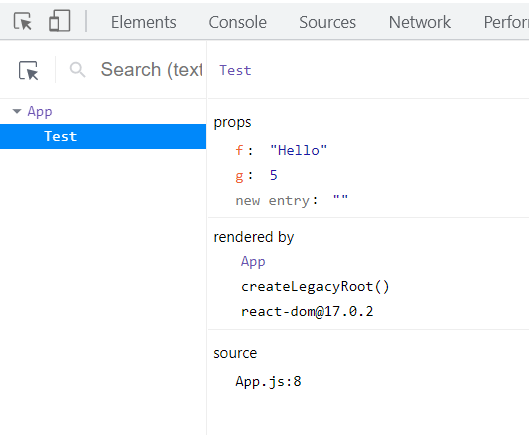
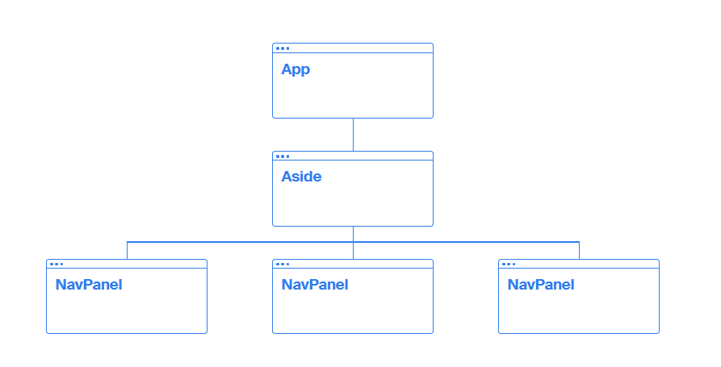
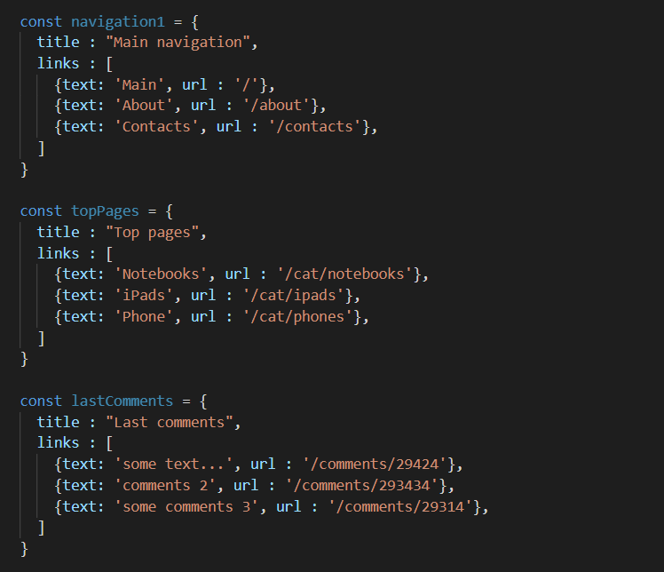
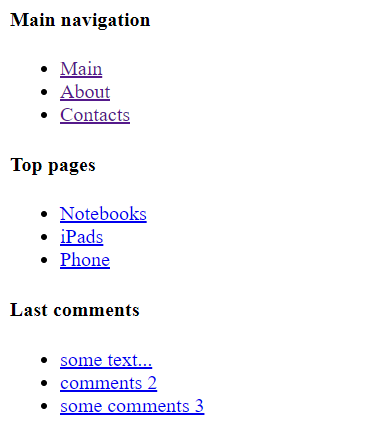

# Передача данных в компонент. Props

# 1. Как строится приложение React

# 2. Как передать пропсы и как их использовать

# 3. Как посмотреть переданные props?

# 4. Практический кейс — повторное использование компонента для вывода меню

# 5. Направления передачи данных с помощью props


## 1. Как строится приложение React

В Unit 01 мы выяснили, что приложение React состоит из компонентов. Компонент представляет из себя изолированный код реализующий определенную логику интерфейса или функций приложения.

Важным словом здесь является слово изолированный. Действительно, компонент — это вещь в себе, и все что мы в рамках компонента реализуем не влияет на остальные компоненты, что очень удобно в больших приложениях. Внимательные читатели могут опровергнуть это заявление, ведь мы импортировали другие компоненты и применяли одни компоненты в других. Это действительно так, а самые внимательные, во втором Unit вспомнят пример с боковым меню, где мы сказали, что можно использовать один и тот же компонент несколько раз, передавая ему данные.

Сделаем пояснение. Компоненты изолированны, однако в рамках компонента можно использовать другие компоненты. Также внутрь компонента можно передать данные. Рассмотрим способ передачи данных внутрь компонента.

Одним из способов передачи данных внутрь компонента являются Props (пропсы) — которые похожи на аргументы в функциях и одновременно, по стилю написания — на атрибуты в HTML.

## 2. Как передать пропсы и как их использовать

Напомню, скачать код можно либо на github, либо на странице курса [https://itgid.info](https://itgid.info).

Для начала создадим компонент Test.js  с очень простым кодом:
```javascript
function Test () {

   return (
      <>
         <p>Вывод props:</p>
      </>
   )
}

export default Test;
```
И подключим его в ``App.js``:

```javascript
import Test from './Test';

function App() {
   
   return (
      <div className="App">
         <Test />
      </div>
   );
}

export default App;
```

Задача – передать данные внутрь компонента ``Test.js``. Применим следующий синтаксис:
```javascript
import Test from './Test';

function App() {
   let t = 'Hello';
 
 return (
   <div className="App">
      <Test f = {t} g = {5} />
   </div>
);
 
}

export default App;
```
Т.е. мы передали внутрь компонента **Test.js** два props, один под именем ``t``, второй под именем ``g``. Посмотрим как принять и вывести эти данные внутри **Test.js**. Допишем аргумент ``props`` в функцию ``Test``.

```javascript
function Test (props) {

   console.log(props);

   return (
      <>
         <p>Вывод props:</p> 
      </>
   )
}

export default Test;
```

Открываем консоль браузера и видим объект:
```javascript
{
   f : "Hello",
   g : 5
}
```

Таким образом, ``props`` внутрь компонента попадают как объект, ключи которого мы задаем, когда передаем props.

Давайте выведем ``props`` на страницу внутри компонента **Test.js**:

```javascript
function Test (props) {

   console.log(props);

   return (
      <>
         <p>Вывод props:</p>
         <p>{props.f}</p>
         <p>{props.g}</p>
      </>
   )
}

export default Test;
```

Т.е. все правила обращения к объектам в js – сохраняются.

### Несколько важных вопросов по пропсам

**Можно ли менять название props внутри функции Test?** Конечно можно. Это аргумент и вы пишите название в соответствии с логикой вашего приложения.

**Мы выводили props. Можно ли их изменять?** Важно! Нет, props можно только читать. Если нужно изменение  - создайте переменную, присвойте туда значение из props и работайте c переменной.

**Важное замечание**. Компонент должен себя вести по отношению к props, как [чистая функция](https://itgid.info/unit/function-2021?unit=jsfunction-08).

**Можно ли передать объект в props?** Да, можно.

**Можно ли передавать в компонент несколько props одновременно?** Да, можно, они будут внутри компонента видны как один объект.

## 3. Как посмотреть переданные props?

Выше мы применяли console.log чтобы посмотреть props переданный внутрь компонента, однако есть более удобные методы. Установим в браузер расширение [React Developer Tools](https://chrome.google.com/webstore/detail/react-developer-tools/fmkadmapgofadopljbjfkapdkoienihi?hl=ru)

После установки — перезапустите браузер. Теперь когда вы откроете инструменты веб разработки браузера, при запущенном компоненте вы увидите вкладки **Components**, **Profiler**.



_Рис. 4.1 Отображение компонентов React во вкладке Components_

Запустите приложение, откройте инструменты веб разработчика, и выберите вкладку ``Components``. Кликните по компоненту **Test.js** и вы увидите переданные в него props.

Применение расширения ``React Developer Tools`` – удобный и быстрый способ контролировать переданные данные.

## 4. Практический кейс — повторное использование компонента для вывода меню

Поставим реальную практическую задачу — написать компонент, который будет выводить меню. Меню представлено в виде списка ссылок. В компонент данные поступают как пропс nav в виде массива. Визуально мы должны получить подобный эффект:


_Рис. 4.2 Компонент меню_

Структура приложения будет следующая:



_Рис. 4.3 Композиция компонентов приложения_

т.е. мы три раза будем вызывать компонент ``NavPanel`` и передавать ему разные данные. Кстати, подобный подход называется композиция компонентов.

Скачайте подготовленный код (unit_04_code_2.zip) и изучите. В коде уже реализованы компоненты **App.js** и **Aside.js**. Также, внутри **Aside.js** находятся массивы с данными для вывода: ``navigation1``, ``topPages``, ``lastComments``.



_Рис. 4.3 Массивы с данными_

Создадим компонент ``NavPanel``, который будет принимать данные и выводить их в виде списка.

Напишем код компонента **NavPanel.js**. Компонент должен принимать props и выводить их на страницу. Вот так:
```javascript

function NavPanel (props) {
   return (
      <div className="navigation">
         <h4>{props.data.title}</h4>
         <ul>
            {props.data.links.map(item => <li key="">{item.text}</li>)}
         </ul>
      </div>
   );
}

export default NavPanel;
```
Для проверки работоспособности кода компонента ``NavPanel.js`` импортируем его в **Aside.js** и передадим данные:
```javascript
import NavPanel from './NavPanel';

function Aside () {

   const navigation1 = {
      title : "Main navigation",
      links : [
         {text: 'Main', url : '/'},
         {text: 'About', url : '/about'},
         {text: 'Contacts', url : '/contacts'},
       ]
   };
   
   return (
      <>
         <NavPanel data = {navigation1} />
      </>
   )
}

export default Aside;
```

Код сработает и мы увидим меню страниц. Давайте доработаем код **NavPanel.js** и сделаем его чуть красивее.

```javascript
function NavPanel (props) {

   const data = props.data;

   return (
      <div className="navigation">
         <h4>{data.title}</h4>
         <ul>
            {data.links.map(item => 
                 <li key={item.text}><a href={item.url}>{item.text}</a></li>)}
         </ul>
      </div>
   );
}

export default NavPanel;
```

В коде выполнено промежуточное присвоение в переменную ``data`` – что позволяет не писать props.data. Добавлены ключи для списка и гиперссылки.

Теперь — подключим данный компонент еще два раза в **Aside.js** и передадим новые данные:
```javascript
return (
   <>
      <NavPanel data = {navigation1} />
      <NavPanel data = {topPages} />
      <NavPanel data = {lastComments} />
   </>
)
```
Видно, что мы компонент использовали три раза. Результат:



_Рис. 4.4 Вывод меню с помощью компонента_

Мы использовали один компонент три раза с тремя разными объектами данных. Скачать результат можно в архиве **unit_04_code_2_final.zip**

## 5. Направления передачи данных с помощью props

Передача данных с помощью props всегда имеет одно направление — в компонент. Т.е. можно передать данные во вложенный компонент с помощью props, но нельзя получить данные из компонента обратно.

Схематически движение данных можно изобразить так

```Component 1 > Component 2```

Т.е. с помощью props можно передать данные из Component 1 в Component 2, если Component 2 **вложен** в Component 1. 

Передать данные в обратную сторону нельзя. Т.е. по схеме выше нельзя данные из 2 передать в 1.

Когда props не помогут? Нельзя передать данные если компоненты не вложены. Т.е. в ситуации:
```
<App1 />
<App2 />
```

Два компонента с помощью props не смогут обмениваться данными. Для обмена данными между такими компонентами и двунаправленной связи мы будем применять redux.

## Итог

Пропсы позволяют передать внутрь компонента данные. По отношению к  props компонент обязан вести себя как pure функция.