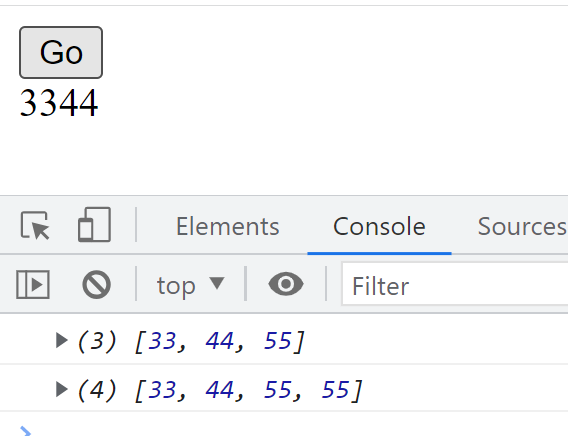

# State
# 1. Что такое state и зачем он нужен?
# 2. Пример практического применения state
# 3. Что такое реактивность в программировании?
# 4. Что класть в state, а что в переменные?
# 5. Особенности state
# 6. State и объекты (массивы)

## 1. Что такое state и зачем он нужен?

Напомню,  React это средство создания интерфейсов, а следовательно, он должен уметь возможность удобного управления визуальными компонентами. Механизм ``state`` создан именно для этого. Его задача — хранить информацию которая влияет или может влиять, на визуальное состояние компонента и позволять осуществить перерисовку компонента при изменении этой информации. Звучит тяжело, однако давайте рассмотрим конкретный пример.

Возьмем нативный JavaScript. Поставим задачу — при нажатии кнопки, увеличивать число в параграфе 1 и выводить на страницу. Набросаем простой код. В  HTML:

```html
<p>1</p>
<button>Go</button>
```

Для простоты, не указаны классы. Как будет выглядеть код JavaScript?

```javascript
const p = document.querySelector('p');
let count = 1;

document.querySelector('button').addEventListener('click', function () {
	count++;
	p.textContent = count;
});
```

Т.е. все действия по получению элементов DOM, по отлову событий, по изменению элементов _(p.textContent = )_ должен взять на себя программист. Учесть и реализовать все моменты. Даже для такого простого действия нам пришлось получать элементы параграфа и кнопки, работать с их свойствами. При этом мы говорим о выводе одного числа. Если интерфейс сложнее то количество операций, которые придется прописать для обеспечения работы с DOM, будет еще больше.

В данном случае число ``count`` – влияет на внешний вид. Его изменение, должно приводить к перерисовке внешнего вида компонента (число на странице меняется). Давайте реализуем подобный код в React.

Для работы со ``state`` необходимо импортировать hook ``useState``. В хук положим начальное значение переменной. При импорте хука создадим две переменные, с помощью которых можно обращаться к значению ``state`` и ``сеттер``, который сохраняет изменения в ``state``. Итак:

```javascript
function App() {

// создаем стейт и задаем начальное значение
const [count, setCount] = useState(1);

const buttonCount = () => {
	// изменяем значение
	let temp = count;
	temp++;
	// сохраняем изменения
	setCount(temp);
}

return (
	<div className="App">
		<button onClick = {buttonCount}>Go</button>
		<p>{count}</p>
	</div>
);
}

export default App;
```

Давайте разберем этот код по шагам. Первая строка:

```javascript
import {useState} from "react";
```

это импорт хука. Фигурные скобки применяются для получения импорта единичного значения из модуля.  

```javascript
// создаем стейт и задаем начальное значение
const [count, setCount] = useState(1);
```

Задаем имя для работы со ``state``, и сеттер — функцию, которая будет изменять значение ``state``. По принятым договоренностям она начинается с префикса set.

Также, здесь задается начальное значение ```state```. В данном случае это число 1.

Перейдем к выводу — коду кнопки:

```javascript
<button onClick = {buttonCount}>Go</button>
```

Обратите внимание, как записываются события. Приставка on пишется в lowerCase, а дальше — событие c большой буквы.  Имя функции указывается в фигурных скобках. Без ().

Сама функция:

```javascript
const buttonCount = () => {
	// изменяем значение
	let temp = count;
	temp++;
	// сохраняем изменения
	setCount(temp);
}
```

написана в стрелочной нотации, однако можно писать и с помощью синтаксиса function.

Получаем значение ``state`` в переменную ``temp``, выполняем операции, и фиксируем результат с помощью сеттера.

**Возникает вопрос**: можно ли менять state напрямую. Например так: count++. Ну, с точки зрения JavaScript менять так константу:
```javascript
const [count, setCount] = useState(1);
```
в принципе, не самая лучшая идея, которая вызовет ошибку. В **React** не рекомендуют изменять ``state`` напрямую. Применяйте для этого сеттер.

Вывод данных осуществляет через ``{}`` :
```javascript
<p>{count}</p>
```
Напишите код или запустите **unit_05_code_01** и изучите как работает приложение. При каждом клике число будет увеличиваться. Но мы в коде нигде не делаем вывод через textContent, innerHTML, как привыкли в JS. Мы только изменяем стейт, а React выполняет перерисовку компонента самостоятельно. Да, именно в этом и состоит преимущества ``state``. 

Итак, когда мы выполняем изменение ``state``, с помощью данной операции  ``setCount(temp)`` React производит перерисовку компонента. Если в ``return`` мы выводим значение ``state``, то значение будет обновлено. 

**Обратите внимание!** Есть особенности работы state – ознакомьтесь с ними в конце этого юнита.

## 2. Пример практического применения state

В первой части unit мы рассмотрели уже как объявлять и применять ``state``. Давайте решим еще одну задачу, которая позволит углубить понимание ``state`` как инструмента для реализации состояния компонента. 

**Задача**. Реализовать range, от 0 до 100, начальное состояние  - 0. При перетягивании ползунка должно выводиться значение value на страницу. 

Давайте определим, какие данные здесь определяют состояние компонента. Очевидно, что таким значением является value ползунка. Т.е. есть и начальное значение, которое выводится, value определяет как ползунок выглядит в начальный момент ( позиция ползунка) и при изменении состояния ползунка обновляется вывод. Поэтому создаем state:
```javascript
const [value, setValue] = useState(0);
```

Дальше пишем return:

```javascript
 return (
	 <div className="App">
	 	<input type="range" value = {value} onChange = {inputHandler} />
	 	<p>{value}</p>
	 </div>
 );
```

Обратите внимание на важный момент. Логика компонента завязана на его состояние. Начальное состояние ползунка — 0 . И это хранится в ``state``. Поэтому
``value = {value}``.

Дальше реализуем функцию ``inputHandler``:

```javascript
const inputHandler = event => {
	setValue(event.target.value);
}
```

Запустите приложение и изучите работу. Если необходимо — скачайте код **unit_05_code_02**.

Для эксперимента, измените в return строку
```javascript
<input type="range" value = {value} onChange = {inputHandler} />
```

на

```javascript
<input type="range" value = "1" onChange = {inputHandler} />
```

Обратите внимание как ведет себя ползунок. State меняется, но поскольку мы прописали ``value``, то ползунок остается на месте. Т.е. мы потеряли "реактивность".

**Реактивность** - потяние на котором основан React. Я не давал его в первых юнитах специально, но теперь настало время. 

## 3. Что такое реактивность в программировании?

Скорее всего, до изучения реакт вы изучали JavaScript. Посмотрите на выражение:

```javascript
let a = 11;
let b = 22;
let c = a + b;
a = 44;
```
Скажите, чему будет равна ``c`` после выполнения этих операций? Правильно, 33. Операция  ``a = 44`` никак уже не влияет на переменную ``c``. Такой подход называется императивным. И даже не зная этого названия вы писали программы именно в таком подходе. Если нужно обновить значение переменной ``c`` с учетом операции ``a = 44`` то придется еще раз выполнять суммирование.

Императивный подход легко читается и пишется, но требует повышенного внимания к каждой операции. 

Существует другой подход - реактивный. В котором рассматриваются взаимосвязанные значения. И если обновится одно из них - обновятся все остальные.

State - пример реактивного подхода. Вывод (render) зависит от данных в ``state``. Обновили данные - выполнится render с учетом изменений. 

В примере с ползунком у нас взаимосвязаными являются положение ползунка, ``value``, вывод на страницу ``value``. Связь осуществляется через ``state``. Изменение любым способом ``value`` повлияет на компонент и приведет к изменению значений и внешнего вида.

## 4. Что класть в state, а что в переменные?

Итак, мы определили — ``state`` это состояние компонента, те данные, которые влияют на интерфейс, т.е. на то, как отображается компонент. И вывод — одновременно простой и сложный, в ``state`` нужно класть те данные, изменение которых должно влиять на интерфейс компонента. Как определить эти данные? На этапе составления документации и проработке архитектуры приложения.

Что будет если все переменные помещать в ``state``? Ничего. Работать будет, но  производительность приложения, будет низкая, из-за того что изменение любых данных будет вызывать перерисовку компонента. Разделяйте переменные которые нужны для вычислений и данные, которые влияют на интерфейс компонента.

## 5. Особенности state и FAQ

### 5.1 Можно ли объявлять на странице несколько state?

Да, можно. Если совместить примеры кодов выше, то это будет выглядеть так:

```javascript
function App() {

	// создаем стейт и задаем начальное значение
   const [count, setCount] = useState(1);
   const [value, setValue] = useState(0);
   
}
```

т.е. вы используете любое количество ``state``, которое вам необходимо.

### 5.2 Можно ли не задавать начальное значение, и положить что-то в ходе работы?

Да, можно
```javascript
const [count, setCount] = useState();
```

однако в реальной задаче, удобно и более правильно, указывать начальное значение, хотя бы для определения типа данных в стейт и возможных операций над данными.

### 5.3 Какие типы данных можно помещать в state?

Любые типы данных JavaScript.

### 5.4 Что перерисовывается при изменении state?

Давайте вернемся к первой задаче со счетчиком и изменим компонент так:

```javascript
import {useState} from "react";

function App() {

	console.log('Компонент сработал');
	const [count, setCount] = useState(1);

	const buttonCount = () => {
		console.log('Функция сработала');
		let temp = count;
		temp++;
		setCount(temp);
	}

return (
	<div className="App">
		{console.log('return сработал')}
		<button onClick = {buttonCount}>Go</button>
		<p>{count}</p>
	</div>
);
}

export default App;
```

Интересная конструкция, согласны? Что же происходит при обновлении страницы?
```
Компонент сработал
return сработал
```

Все логично. Был обработан компонент, и отработал вывод на страницу. А если мы нажмем кнопку?

```
Функция сработала
Компонент сработал
return сработал
```

Т.е. сработает функция  ``buttonCount``, а потом компонент заново будет запущен, и отработает return. Т.е. компонент перезапускается полностью! Неожиданно, но логично. Ведь мы не можем запускать “часть” функции в JavaScript.

Сразу возникает вопрос — ведь перезапуск при каждом изменении ``state`` это накладно с точки зрения нагрузки? Переходим к следующему вопросу...

### 5.5 Когда state перерисовывает страницу?

Хороший и важный вопрос. Из сказанного выше можно подумать что написав:

```javascript
setCount(444);
```

мы тут же вызовем перерисовку страницы. Однако это не так. Возьмем пример из первой задачи и напишем такой код:

```javascript
const buttonCount = () => {
	let temp = count;
	temp++;
	setCount(555);
	setCount(777);
}
```

Что произойдет в таком случае? Будет ли отрисовка сразу после команды ``setCount(555)`` и мы увидим только его и код не дойдет до 777, либо будет выведено число 777?

**Вопрос важный**. Давайте разбираться. Мы уже выяснили что изменение ``state`` перерисует весь компонент. Вопрос в чем? В данном случае будет перерисовка один раз или два?

Если применить метод из предыдущего вопроса мы увидим, что сначала отработает код

```javascript
setCount(555);
setCount(777);
```

И только потом будет компонент перерисован. Т.е. **отрисовка пройдет после всех изменений state**. Зачем это нужно? Для производительности — тем самым значительно уменьшается количество отрисовок компонента.

Документация говорит следующее: **React** может сгруппировать несколько вызовов ``setState()`` в одно обновление для улучшения производительности и обновлять их асинхронно.

## 6. State и объекты (массивы)

Особенностью объектов в JS является хранение по ссылке. Т.е. когда вы пишите
```javascript
let arr = [55, 66, 77];
```

внутри переменной ``arr`` хранится ссылка на область памяти, где хранятся данные. Поэтому операция типа:

```javascript
	 let arr2 = arr;
```
не приводит к появлению нового массива. Внутри ``arr2`` лежит ссылка на область памяти. Т.е. переменные ``arr``, ``arr2`` ссылаются на одну и ту же область. При изменении в массиве ``arr``, мы увидим такие же изменения в ``arr2``.

Хранение по ссылке приводит к интересным следствиям в рамках ``state``. Рассмотрим код:

```javascript
import {useState} from 'react';

function App() {

	const [arr, setArr] = useState([33, 44]);

const clickHandler = () => {
	let tempArr = arr;
	tempArr.push(55);
	console.log(tempArr);
	setArr(tempArr);
}

return (
	<div className="App">
		<button onClick={clickHandler}>Go</button>
		<div>{arr}</div>
	</div>
);
}

export default App;
```

В коде создан ``state`` объект с начальным значением [33, 44]. При нажатии кнопки button выполняется функция, которая производит **push** в массив, и записывает новые значения в ``state``. В этом легко убедиться просматривая console. Однако на странице ничего не изменяется:



_Рис. 5.1 State не обновляет вывод на странице_

Давайте разбираться. Ситуация довольно простая, однако ставит новичка в тупик. Напомню — ``state`` вызывает рендер страницы при изменении. Однако когда мы делаем:
```javascript
let tempArr = arr;
```

внутри переменной ``tempArr`` лежит ссылка на объект. В ``state`` лежит тоже ссылка на объект. Т.е. и ``state`` и ``tempArr`` ссылаются на один объект. Операция: 
```javascript
tempArr.push(55);
```

добавляет число 55 в объект, но не меняет ссылку. Т.е. с точки зрения **React**, ``state`` не изменился. И, следовательно, операция:
```javascript
setArr(tempArr);
```
не поменяла ``state``, и отрисовки не будет.

**Важно!** Смотреть содержимое ``state`` можно через **React Developer Tools**.

Как вывести массив на страницу? Нужно явно изменить ссылку на объект, чтобы React увидел изменение в ``state``. Так:

```javascript
const clickHandler = () => {
	let tempArr = [...arr] ;
	tempArr.push(55);
	console.log(tempArr);
	setArr(tempArr);
}

```

Т.е. мы создаем независимую копию массива и работаем с ней. Данная операция не является оптимальной по скорости. Если массив содержит большое количество данных, то возможен и другой подход — менять другой ``state``, что приведет к перерисовке страницы и к выводу массива в новом состоянии.

# Итог
Если разрабатывать интерфейс не с точки зрения "manual" вывода, а с точки зрения состояния и данных необходимых для этого, можно значительно упростить разработку интерфейса, а ``state`` **React** позволяет упростить работу с такими данными состояния и реализует отрисовку при их изменении.