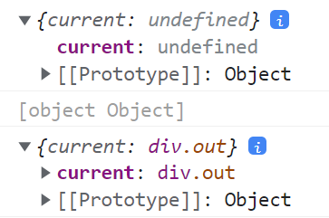

# Ref – зачем и как?
## [1. Что такое ref и зачем он нужен?](#1-что-такое-ref-и-зачем-он-нужен-1)
## [2. Как применять ref?](#2-как-применять-ref-1)

Данный курс в полном объеме:
- все материалы
- коды уроков
- домашнее задание
- поддержка
- помощь в решении и разборе дз
- проверка дз и перепроверка

доступен тем, кто приобрел курс [React.js](https://itgid.info/course/reactjs)

_Текущий юнит написан на React v18._

**Примечание.** Рассматриваем функциональные компоненты.

## 1. Что такое ref и зачем он нужен?

В нативном JavaScript можно обратиться к элементу на странице через **querySelector** или **getElement…** Однако, в предыдущих разделах мы постоянно старались свести задачи к состояниям и отказаться от прямого воздействия на DOM элементы, поскольку это противоречит идеологии React подхода. Однако в реальности бывают задачи когда такое обращение — необходимо. Например, нужно управлять кнопками в плеере, либо работать с подключенным плагином слайдера, или работать с анимацией... Такие задачи можно решать через ``ref``.

**Примечание**. Строго говоря мы и в **React** можем применить **querySelector** или **getElement…** и они сработают,  однако это противоречит идеологии.

Возникает вопрос — не нарушает применение ``ref`` идеологию **React** подхода? Честным ответом будет: ``ref`` это легальный метод нарушения потока данных, который реализован в **React** для крайних случаев. Т.е. ``ref`` позволяют нарушить "общепринятое направление — поток данных" и позволяют напрямую обращаться к элементу.

## 2. Как применять ref?

Приведу простой пример применения ``ref``. В данном случае можно и нужно обойтись ``state``, но нас интересует именно процесс создания и применения ссылок.

```javascript
function App() {
  return (
    <>
      <div><button onClick={buttonClick}>Button</button></div>
      <div className="out"></div>
    </>
  );
}

export default App;
```

Задача: при нажатии клика вывести в out текст "GO". Создадим ссылку:

```javascript
const out = useRef(null); // ref => { current: null }
```
Обращаю ваше внимание — что для применения ``useRef`` необходимо выполнить ``import``:

```javascript
import React, { useRef } from 'react';
```

Здесь мы создали ссылку, однако никуда ее не повесили. Кстати, значение **null** можно упустить. Например, написать так:

```javascript
const out = useRef();
```

Также вместо **null** можно также сразу привязать элемент.
Теперь необходимо присвоить ссылку нужному элементу. Это делается через синтаксис ``{}``:

```javascript
import React, {useRef} from 'react';

function App() {
  const out = useRef();
	
  const buttonClick = () => {
  }

  return (
    <>
      <div><button onClick={buttonClick}>Button</button></div>
      <div className="out" ref={out}></div>
    </>
  );
}

export default App;
```
В данном случае ``div.out`` присвоена ссылка c именем ``out``. Теперь можно напрямую обращаться к данному элементу.

Как выглядит обращение?

```javascript
  out.current.textContent += "GO";
```
Пробуем код:

```javascript
import React, {useRef} from 'react';

function App() {

  const out = useRef();

  const buttonClick = () => {
    out.current.textContent += "GO"
  }

  return (
    <>
      <div><button onClick={buttonClick}>Button</button></div>
      <div className="out" ref={out}></div>
    </>
 );
}

export default App;
```
При нажатии кнопки выводятся ``GO``. Отлично, однако давайте разберемся, что такое ``current``. Давайте дополним код двумя простыми ``console.log``, так:

```javascript
import React, {useRef} from 'react';

function App() {

  const out = useRef();
  console.log(out);

  const buttonClick = () => {
		console.log(out);
    out.current.textContent += "GO"
  }

  return (<>
    <div><button onClick={buttonClick}>Button</button></div>
    <div className="out" ref={out}></div>
  </>);
}

export default App;
```

и изучим, что будет выведено в консоль браузера. Если тяжело понять код - вот вам изображение консоли Chrome:



т.е. ``out`` это объект, в свойстве ``current`` которого пока не лежит ничего. Однако когда кнопка будет нажата, а к этому моменту произведен render, то внутри ``current`` будет ссылка на ``div.out``:

Итак, опытным путем мы узнали что лежит в ``current``. А теперь что говорит документация:

>Когда атрибут ref используется с HTML-элементом, свойство current созданного реф в конструкторе с помощью React.createRef() получает соответствующий DOM-элемент.

Конечно же, можно создавать любое количество ``ref`` и присваивать нужным элементам.

## Итог

Ref в функциональных компонентах позволяет напрямую обращаться к элементу, что оправдано для случаев применения сторонних DOM библиотек в **React**, управления анимацией, управлением фокусов элементов и воспроизведением медиа.

Однако не стоит злоупотреблять ref, и стараться решать задачи в рамках идеологии **React**.