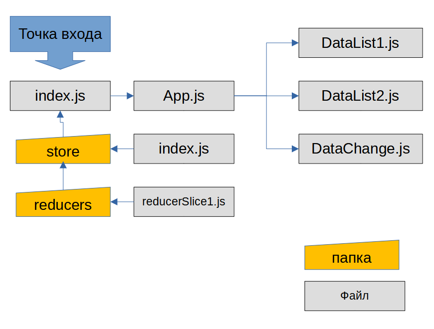
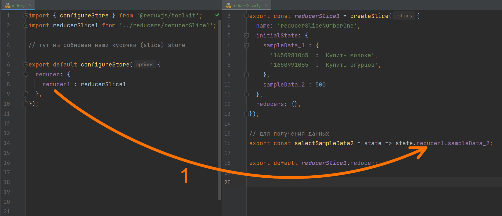

# Redux – все не так сложно!

## 1. Что такое Redux?
## 2. Как установить redux в проект
## 3. Ставим задачу
## 4. Создаем Store, Reduce и подключаем к приложению
## 5. Получение информации из store

Данный курс в полном объеме:
- все материалы
- коды уроков
- домашнее задание
- поддержка
- помощь в решении и разборе дз
- проверка дз и перепроверка

доступен тем, кто приобрел курс [React.js](https://itgid.info/course/reactjs)

_Текущий юнит написан на React v18._

**Примечание.** Рассматриваем функциональные компоненты.


## 1. Что такое Redux?

Мы с вами в [5 юните](https://github.com/itgidinfo/react_book/blob/master/unit_05/unit_05.md) познакомились с понятием ``state`` и изучили идеологию *React*, который опираясь на ``state`` рисует и перерисовывает компонент. Важно отметить, что ``state`` мы рассматривали в рамках компонента (и объявляли и изменяли и визуализировали).

Теперь, после этого напоминания, вспомним как компоненты могли передавать данные между собой? Мы знаем только механизм props (unit 4), который работал только если один компонент вложен в другой. Других механизмов мы не знаем.

Получается, что если мы хотим данные из ``state`` одного компонента передать в другой компонент, то реализовать подобное можно только если компонент 2 вложен в компонент 1, и только при помощи props. Согласитесь, не очень удобно. А в некоторых случаях построить систему только вложением компонентов просто не возможно.

Итак, есть проблема обмена данными между компонентами. Частично решаемая через props, но только частично и при иерархическом вложении. Причем связь однонаправленная, отправить данные в компонент можно, а получить обратно? А если бы было можно, то как контролировать потоки данных? Не потеряем ли мы прелесть изолированных компонентов?

Перейдем наконец к ``redux``. Представим себе ``state``, который вынесен отдельно и централизован. Каждый компонент, при желании может писать туда данные (изменять состояние) либо читать данные. При этом правила чтения-записи мы определяем при создании такого централизованного хранилища (store). Т.е. анархии и самопроизвольного изменения данных ``redux`` не допускает. При этом, при изменении данных в store, все компоненты, которые используют эти данные будут оповещены и смогут изменить (перерисовать) свое состояние.

Так вот — ``redux``, представляет собой такое хранилище, при необходимости доступное компонентам с возможностью контролировать операции чтения записи и оповещения при изменении таких данных.

Несколько важных замечаний для новичков. ``Redux`` не база данных и не сохраняет состояние после перезапуска приложения. Не стоит путать данные вещи. ``Redux`` не единственный и уникальный представитель подобных технологий. Вы можете написать подобный код самостоятельно, либо применять альтернативы. ``Redux`` не является обязательным в проекте. Применяйте ``Redux`` только там, где он необходим, иначе проект будет запутанным.

Что дает такое хранилище? В первую очередь — возможность общения между компонентами. Т.е. изменили данные в store в одном компоненте 1, будет оповещен компонент 2 и изменит свое состояние. Причем компоненты не связаны между собой (точнее связаны посредством ``redux``).

Думаю достаточно теории. Пора перейти к практике. Давайте установим ``redux`` и создадим первую программу с хранилищем данных.

## 2. Как установить redux в проект

Для установки ``redux`` применяйте следующий код:

```javascript
npm install react-redux
```

Если вы зайдете на сайт https://redux.js.org/, то увидите что ``redux`` предлагает два подхода — работать просто с ``redux``, либо работать с ним же посредством набора инструментов от создателей ``redux``. К сожалению, а может и нет, на всех проектах мне приходилось работать именно с таким набором Redux Toolkit и именно на его примере я буду строить приложение. Поэтому установим redux-toolkit:

```javascript
npm install @reduxjs/toolkit
```

Конечно же, если вы будете применять ``redux`` без набора toolkit, то устанавливать его нет необходимости.

## 3. Ставим задачу

Чтобы отработать работу с ``redux`` давайте создадим элементарное приложение. Я не буду повторять всем надоевший todolist, а просто покажу как:

- создавать хранилище с помощью ``redux``
- как получить информацию из хранилища в компоненте
- как изменять информацию в хранилище

Структура приложения будет выглядеть так:



_8.1 Структура приложения_

Изучите как будет выглядеть приложение с ``redux``. Важно понимать — в данном случае это очень простая структура, цель которой научиться не бояться ``redux``. Данную структуру еще можно упростить, например убрать папку reducers и переместить из нее файлы в store. Нет “официально одобренной” структуры. В каждом приложении структура будет разная.

Также важно понять что все названия файлов и папок не являются зарезервированными и могут быть изменены в вашем проекте. Я выбрал названия с целью отразить назначение каждого блока.

Давайте пройдемся по структуре и введем несколько определений ``redux``. Описание предельно упрощено, для понимания:

- **store** – то самое централизованное хранилище ``state`` описанное в первом разделе. Здесь хранятся данные, которыми манипулирует ``redux``.
- **action** – это описанные действия над данными. 
- **редьюсер (reducer, редукторы)** – функции, которые изменяют состояние store на основании action. Т.е. берет данные из store (состояние) применяет action и вычисляет следующее состояние.

Довольно запутано, но потерпите несколько минут, все станет на свои места. Давайте начнем с кода.

Надеюсь вы создали новое приложение, и установили ``redux``, toolkit как описано в этом разделе. Переходим к созданию приложения.

## 4. Создаем Store, Reduce и подключаем к приложению

После создания нового приложения, создадим папку reducers. В ней файл **reducerSlice1.js**. Мы вначале создадим редьюсеры. На самом деле применим redux-toolkit который его создаст, а мы  передадим нужную для создания редьюсера и store конфигурацию.

Итак, создаем файл **reducerSlice1.js**. Почему reducer понятно, мы создаем редьюсер. Почему Slice? Потому что таких файлов может быть несколько и они как кусочки создадут store. Хотя никто не мешает использовать другие имена, но обычно Slice добавляют в конце.

Внутри файла выполним импорт 

```javascript
import { createSlice } from '@reduxjs/toolkit';
```

Теперь мы создадим будущий кусочек store. Для этого мы применим метод createSlice, который и выполнит за нас всю работу. Данный метод требует данных в виде объекта. Что мы должны передать внутрь? Объект вида:

```javascript
{
  name: 'reducerSliceNumberOne',
  initialState : {
    sampleData_1 : {
    '1650981065' : 'Купить молока',
    '1650991065' : 'Купить огурцов',
    },
    sampleData_2 : 500
  },
reducers: {}
}
```  

давайте разбираться:
- **name (обязательный параметр)** — имя создаваемого редьюсера;
- **initialState** – объект с начальными данными для store. В store можно хранить разную информацию, но store всегда объект, т.е. есть ключ и данные. В данном примере в store мы будем создавать две записи, одну — объект с ключом sampleData_1, вторую — число с именем sampleData_2. Количество записей, тип данных, название ключей вы выбираете исходя из ваших нужд;
- **reducers** – объект где мы опишем actions для работы с данными.

В итоге наш код будет выглядеть так:
```javascript
import { createSlice } from '@reduxjs/toolkit';

export const reducerSlice1 = createSlice({
  name: 'reducerSliceNumberOne',
  initialState: {
    sampleData_1 : {
    '1650981065' : 'Купить молока',
    '1650991065' : 'Купить огурцов',
    },
    sampleData_2 : 500
  },
  reducers: {},
});

export default reducerSlice1.reducer;
```

и в конце мы экспортируем созданный редьюсер.

Обратите внимание, что у нас смешались в данной операции понятия action, начальные значения для данных store, и редьюсеры. Увы это так, однако здесь нам остается только принять такой синтаксис.

С другой стороны мы в одном файле сделали все действия необходимые для создания store (части хранилища): описали данные, и потом добавим действия с ними.
Теперь создадим папку store и в ней файл index.js. Здесь мы соберем store из созданных нами кусочков (slice). Напишем внутри index.js следующий код:

```javascript
import {configureStore } from '@reduxjs/toolkit';
import reducerSlice1 from '../reducers/reducerSlice1';

// тут мы собираем наши кусочки (slice) store
export default configureStore({
	reducer: {
		reducer1 : reducerSlice1
	},
});
```

Тут аналогично предыдущему варианту мы тоже настраиваем store. Внутрь передаем редьюсеры, которые импортировали. Мы их собираем в виде объекта:
```
имя : импортированный редьюсер
```

Имя, может быть любое. Для простоты я выбрал **reducer1**.

**Обращаю ваше внимание!** Возможно сейчас действия кажутся запутанными. Мы сказали, что  есть store, reducer, action однако только запускаем их конфигурацию. Вы не видите их нативно в коде, не можете “пощупать” и это очень путает. Увы данное чувство возникает у всех, кто только начинает работать с фреймворками, библиотеками. Не забывайте что реализация ``redux`` от нас скрыта в недрах папки node_modules, однако она есть и мы обязаны выполнять ее требования по настройке (что мы и делаем сейчас), а все остальное библиотека сделает за нас.

В принципе, создание хранилища закончено. Даже в таком простом виде можно подключить хранилище в приложение и применять его. Давайте зайдем в index.js – точку входа приложения и импортируем нужные модули:

```javascript
import { Provider } from 'react-redux';
import store from './store';
```

Для того, чтобы дать возможность приложению общаться со store, необходимо обернуть точку входа в теги Provider, так:

```javascript
const root = ReactDOM.createRoot(document.getElementById('root'));
root.render(
  // <React.StrictMode>
    <Provider store={store}>
      <App />
    </Provider>
  // </React.StrictMode>
);
```

для того чтобы не дублировался вывод в консоль — закомментирован тег StrictMode.
Все, store подключен, и можно попытаться вывести информацию из store на страницу. 

## 5. Получение информации из store

Мы создали и подключили store, и теперь настало время научиться читать информацию из него. В первом разделе были написано:

>>redux, представляет собой такое хранилище, при необходимости доступное компонентам с возможностью контролировать операции чтения записи и оповещения при изменении таких данных. “

Т.е. мы не можем напрямую взять данные из store, нам необходим вспомогательный метод — такой метод называется **useSelector**.

Однако одного метода мало. Мы должны вернуться в редьюсер и прописать путь доступа к данным. Помните в файле store/index.js мы писали такую строку:

```javascript
export default configureStore({
  reducer: {
    reducer1 : reducerSlice1
  },
});
```

отсюда нам нужно взять имя reducer1 и открыть файл **reducerSlice1**. В него дописать внизу такое:

```javascript
export const selectSampleData2 = state => state.reducer1.sampleData_2;
```

Да, для начала попробуем вывести число 500 из store, которое хранится под ключом **sampleData_2**.

Давайте разберем что мы написали. Мы создали функцию (стрелочную) которая возвращает данные из store через reducer1. Здесь **selectSampleData2** любое имя, под которыми мы будем пользоваться данными из store. А строка ``state.reducer1.sampeData_2`` показывает что из store редьюсера reducer1 мы будем брать данные sampleData_2. 

Запутано? Да. Я приведу картинку чтобы было понятнее связь:



Рис. 8.2 Связь имени редьюсера и экспорта данных

Ну и последний шаг. В компоненте **App** напишем такой код:

```javascript
import {useSelector} from 'react-redux';
import {selectSampleData2} from './reducers/reducerSlice1';

function App() {

const data2 = useSelector(selectSampleData2); // получаем данные из store

return (
  <div className="App">
    <h1>React redux - simple example</h1>
    {data2}
    </div>
  );
}

export default App;
```
Давайте его разберем. Первая строка импортируем useSelector – хук для получения данных из store.
Строка

```javascript
import {selectSampleData2} from './reducers/reducerSlice1';
```

импортирует из редьюсера ту функцию, которая возвращает данные из store.
Теперь для получения данных нужно в useSelector передать функцию получения данных:

```javascript
const data2 = useSelector(selectSampleData2);
```

И вывести эти данные, либо произвести манипуляции с ними. Запустите код, изучите как он работает. Убедитесь что на страницу выведено число 500.

В следующей главе мы усложним задачу и допишем остальные компоненты.

## Итог
``Redux`` — это возможность вынести данные в централизованное хранилище и работать с ними. В данной главе мы научились создавать хранилище, и заносить в него начальные данные. Научились подключаться к хранилищу и выводить данные из него.